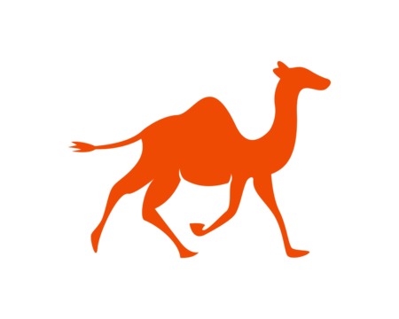

<p align="center">
  
</p>

# Qamel

Qamel is a model-free reinforcement learning agent that learns to schedule entanglement operations in a quantum repeater chain, minimising the number of operations required to produce an end-to-end entangled link across `n` nodes.

The agent operates in a stochastic environment where elementary link generation succeeds with probability `pgen` and entanglement swapping succeeds with probability `pswap`. At each timestep it decides which links to attempt generating and which repeater nodes to attempt swapping.

## Agents

### Tabular Q-learning (baseline)
A Q-table over enumerated adjacency states. Suitable for small `n`.

### DQN
A deep Q-network that takes a tensor observation of the chain state and outputs Q-values for all valid actions. The observation encodes:
- the current adjacency matrix,
- per-link generation and swap attempt counters (normalised),
- a global swap-readiness signal indicating how many interior nodes have both neighbours entangled.

The network is a two-hidden-layer MLP. Hidden layer width is set to `max(512, 4 × input_size)` rounded up to the nearest 256, giving sufficient capacity for larger chain sizes. Training uses an experience replay buffer, a target network updated periodically, and epsilon-greedy exploration with linear decay.

An optional **curriculum** gradually increases the episode horizon during training, allowing the agent to learn on easier instances before tackling the full problem.

## Project Structure

```
project_root/
│── analytical_solution/
│   │── monte_carlo.py
│   │── analytical_equations.py
│   └── utils.py
│
│── qamel/
│   │── agent.py          # Tabular Q-learning agent
│   │── dqn.py            # DQN network and observation preprocessing
│   │── environment.py    # RepeaterChain environment
│   └── utils.py
│
│── scripts/
|   │── train_qamel.py    # Training entry point (tabular and DQN)
│   │── evaluate_qamel.py # Evaluation entry point
│   └── run_stage2_study.sh  # Multi-budget training study driver
│
│── notebooks/
│   │── calculate_ratio_and_latencies.ipynb
│   │── verify_simulation.ipynb
│   └── analysis_of_results.ipynb
│
│── README.md
└── .gitignore
```

## Training

### Tabular agent
```sh
python ./scripts/train_qamel.py --pgen pgen --pswap pswap --n n
```

### DQN agent
```sh
python ./scripts/train_qamel.py --pgen pgen --pswap pswap --n n \
    --obs_mode counter_exposed_plus_ready \
    --reward_mode base \
    --model_tag my_run
```

Key flags:
| Flag | Description |
|------|-------------|
| `--obs_mode` | Observation type: `adjacency`, `counter_exposed`, or `counter_exposed_plus_ready` |
| `--model_tag` | Name used for saving checkpoints and outputs |
| `--use_curriculum` | Enable progressive horizon curriculum |
| `--train_episodes` | Number of training episodes per budget stage |
| `--swap_ready_bonus` | Bonus reward for swap-ready states |

### Multi-budget study (cluster)
```sh
bash scripts/run_stage2_study.sh
```
Trains the DQN sequentially at increasing episode budgets, evaluates at each checkpoint, and archives results to `qamel/outputs/studies/`.

## Results

DQN with curriculum learning (`counter_exposed_plus_ready`, `pgen=0.4`, `pswap=0.7`):

| n | Budget | Success Rate |
|---|--------|-------------|
| 5 | 10,000 | 90.4% |
| 6 | 20,000 | in progress |

## Accepted paper
The verified results (demonstrated in the `verify_simulation.ipynb` notebook) have been accepted at OFC 2025, with the paper presented as `OFC_paper_2025.pdf` in the repository.

## License
This project is licensed under the MIT License. See `LICENSE` for details.
