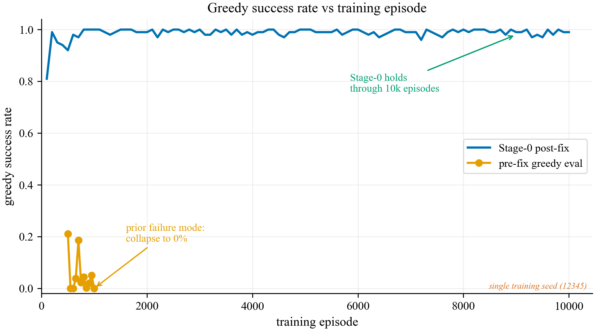
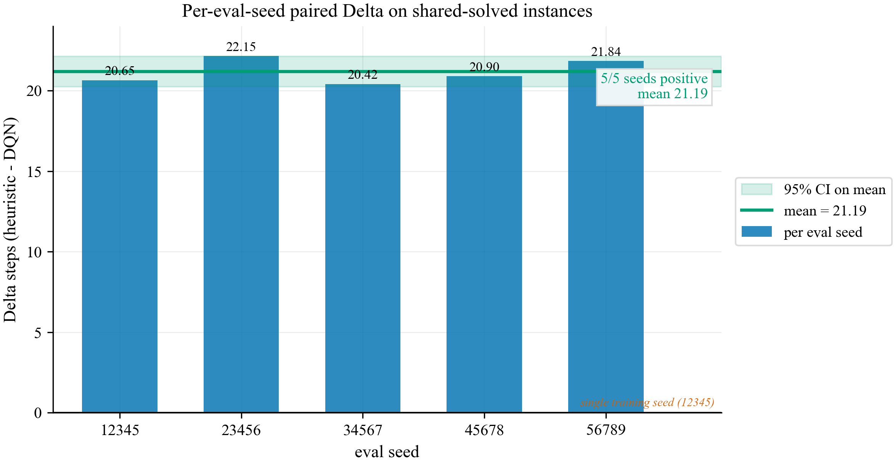
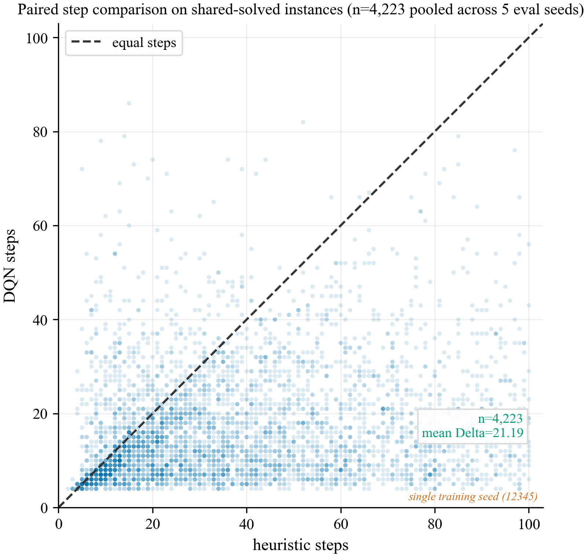
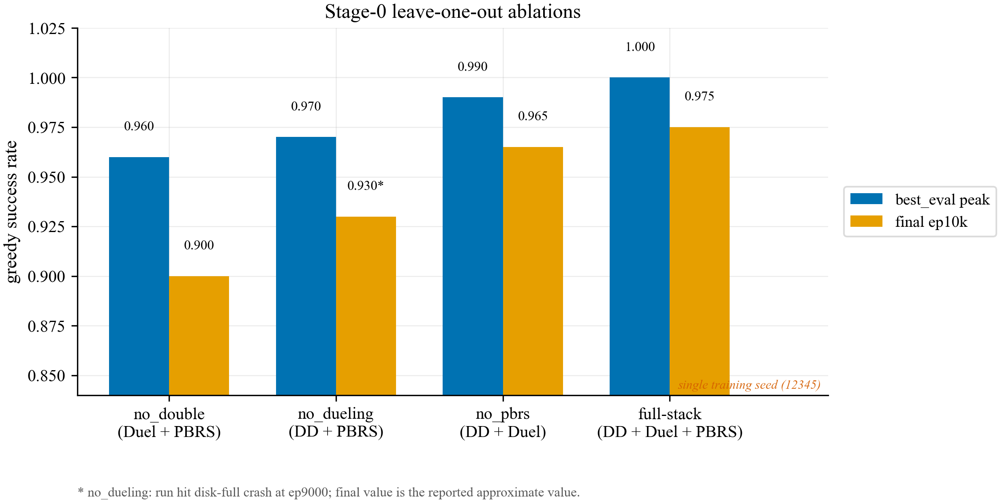

# Technical Report: `Timing-Multiuser-Protocols`

## Title
Technical Report on the `Timing-Multiuser-Protocols` Codebase

## Executive summary

The executable reinforcement learning code in this repository implements a stochastic **1D quantum repeater-chain control problem**, not a full multi-user grid multipartite-entanglement environment. The main environment is `RepeaterChain`, which models binary entangled links on a line of `n` nodes and lets the agent choose which adjacent links to attempt generating and which interior repeater nodes to swap in each step ([`qamel/environment.py#L3`](qamel/environment.py#L3), [`qamel/utils.py#L4`](qamel/utils.py#L4)).

At the same time, the broader repository framing is larger than the RL implementation:

- the README claims a model-free RL agent for "`n` node grid topology" and multipartite entangled distribution ([`README.md#L7`](README.md#L7)),
- the analytical code and notebooks focus on **grid-based multipartite entanglement, swapping, fusion, and latency** ([`analytical_solution/analytical_equations.py#L60`](analytical_solution/analytical_equations.py#L60), [`analytical_solution/monte_carlo.py#L4`](analytical_solution/monte_carlo.py#L4)),
- the paper PDF frames the work as latency of multipartite entanglement distribution in a quantum SDN architecture.

So the repository is currently split into two partially disconnected models:

| Layer | Actual modeled problem |
| --- | --- |
| RL code | Bipartite end-to-end entanglement over a repeater chain |
| Analytical code / notebooks / paper framing | Multipartite grid distribution with fusion and latency |

This mismatch is the single most important issue in the codebase.

Beyond that, the repository contains:

- a tabular Q-learning baseline over enumerated adjacency states ([`qamel/agent.py#L8`](qamel/agent.py#L8)),
- a DQN over tensor observations ([`qamel/dqn.py#L18`](qamel/dqn.py#L18)),
- analytical Markov and Monte Carlo utilities for a different problem definition,
- evaluation scripts and notebooks that export operation counts and derive latency estimates.

The Stage-0 DQN path has been strengthened since the first audit. The current
code now supports the `counter_exposed_plus_ready` observation mode end-to-end,
separates terminated and truncated episode endings in the replay target,
validity-masks next-state DQN targets, and exposes Double-DQN, dueling-network,
and potential-based reward shaping (PBRS) options. The remaining reliability
issues are therefore more specific:

- the baseline Q-learning exploration rule is wrong,
- the baseline terminal Q update is wrong,
- baseline saved models ignore `pgen` and `pswap`,
- the tabular baseline still observes only adjacency while the richer DQN state
  includes counters and swap readiness,
- the published Stage-0 claim is currently a single-training-seed result with
  five paired evaluation seeds; the 10-training-seed escalation is in progress,
- notebook workflows depend on missing files and hard-coded external paths.

## Stage-0 result update: figures, method, and physics

Date: 2026-06-15

The current Stage-0 result is a **corrected single-training-seed** result for the
`n=5`, `pgen=0.4`, `pswap=0.7` repeater-chain task. It should be read as a
locked Stage-0 result, not as the final 10-training-seed paper result. The
multi-seed escalation is expected to supersede the single-training-seed headline
numbers.

The figure source is [`notebooks/stage0_figures.ipynb`](notebooks/stage0_figures.ipynb).
The generated figure files are:

| Figure | Files | What it supports |
| --- | --- | --- |
| Stage-0 collapse fixed | [`figures/fig_stage0_collapse_fixed.pdf`](figures/fig_stage0_collapse_fixed.pdf), [`figures/fig_stage0_collapse_fixed.png`](figures/fig_stage0_collapse_fixed.png) | The corrected Stage-0 training path removes the late greedy-evaluation collapse seen in the earlier checkpoint sweep. |
| Paired per-seed step delta | [`figures/fig_stage0_paired_delta.pdf`](figures/fig_stage0_paired_delta.pdf), [`figures/fig_stage0_paired_delta.png`](figures/fig_stage0_paired_delta.png) | On identical shared-solved evaluation instances, the learned policy uses about 21 fewer steps than the swap-as-soon-as-possible heuristic. |
| Paired scatter | [`figures/fig_stage0_paired_scatter.pdf`](figures/fig_stage0_paired_scatter.pdf), [`figures/fig_stage0_paired_scatter.png`](figures/fig_stage0_paired_scatter.png) | Episode-level paired comparison: most shared-solved instances lie below the `y=x` diagonal, meaning DQN steps are fewer than heuristic steps. |
| Leave-one-out ablation | [`figures/fig_stage0_ablation.pdf`](figures/fig_stage0_ablation.pdf), [`figures/fig_stage0_ablation.png`](figures/fig_stage0_ablation.png) | Double-DQN is the largest stabilizer in this Stage-0 stack; dueling and PBRS help incrementally once the termination/truncation fix is in place. |









### Stage-0 training configuration

The Stage-0 full-stack run is:

- run directory: `qamel/outputs/runs/dqn_n5_pgen0.4_pswap0.7_stage0_fullstack_s12345/`,
- checkpoint used for evaluation: `checkpoints/best_eval.pt`,
- chain size: `n=5`,
- elementary generation probability: `pgen=0.4`,
- swap success probability: `pswap=0.7`,
- observation mode: `counter_exposed_plus_ready`,
- architecture: dueling DQN head,
- target update: Double-DQN target selection/evaluation split,
- reward: base environment reward plus PBRS during training,
- PBRS scale: `1.0`,
- training seed: `12345`,
- training episodes: `10000`,
- max actions per episode: `100`,
- best-eval cadence: every `1000` training episodes, evaluated over `200` episodes,
- optimizer settings for the Stage-0 escalation path: learning rate `5e-4`, batch size `256`.

This is deliberately narrower than the repository's older multipartite-grid
framing. It is a controlled DQN result for a one-dimensional chain.

### Stage-0 physical interpretation

The physical substrate represented by the executable environment is a repeater
chain, not a two-dimensional quantum network. Each node is a station with quantum
memory; adjacent stations can attempt elementary Bell-pair generation, and an
interior station with two incident links can attempt entanglement swapping.

The environment state has three physical/control channels:

- `state[0]`: binary link adjacency; a `1` means an entangled link is currently present,
- `state[1]`: per-node generation-attempt counters on the diagonal,
- `state[2]`: per-node swap-attempt counters on the diagonal.

The Stage-0 DQN also observes a fourth derived channel in
`counter_exposed_plus_ready`: a global swap-readiness signal equal to the number
of interior nodes whose degree is two. That signal is not a new physical process;
it is a compact control feature exposing when the chain has local Bell pairs in a
configuration that can be contracted by swapping.

At each discrete environment step the policy chooses a structured action matrix:

- one-off-diagonal entries request elementary generation on nearest-neighbor chain segments,
- interior diagonal entries request swaps at repeater nodes,
- invalid actions are masked so the policy cannot intentionally exceed degree constraints or request swaps at nodes that are not ready.

Generation and swap outcomes are Bernoulli trials. A successful elementary
generation creates a nearest-neighbor Bell pair. A successful swap consumes two
shorter links at an interior node and creates a longer link between the two
outer endpoints. Repeating this contraction process can eventually create the
terminal end-to-end link between node `0` and node `n-1`.

The model intentionally omits several physical effects: no fidelity, decoherence,
dark counts, memory lifetime, purification, classical signaling time, routing
delay, or wavelength/channel contention are included. Therefore the Stage-0
claim is about **control efficiency in discrete repeater-chain scheduling**:
given the same stochastic link-generation and swap process, the learned policy
spans the chain in fewer decision steps than the heuristic while preserving
equal-or-better success.

### Stage-0 RL method

The Stage-0 DQN stack uses four changes that matter scientifically and
algorithmically.

First, terminated and truncated episodes are separated. A true terminal event is
success or a bad state. A time-limit cutoff is a truncation: the episode stopped
because `max_actions` was reached, not because the MDP reached an absorbing
failure. The Bellman target therefore masks bootstrap only on true termination,
not on truncation. This avoids teaching the DQN that every time-limited state has
zero continuation value.

Second, the next-state target is validity-masked. Acting-time masking alone is
not enough: if the target backup takes a maximum over invalid actions, the
network can overestimate impossible continuations. Stage-0 computes the valid
action mask for each next state and applies it before the max or before the
Double-DQN argmax.

Third, Double-DQN and the dueling head address two different instability modes.
Double-DQN uses the policy network to choose the best valid next action and the
target network to evaluate that action, reducing maximization bias. The dueling
head decomposes each action value as

```text
Q(s, a) = V(s) + A(s, a) - mean_a A(s, a),
```

which lets the network learn a state value separately from action advantages.
This is helpful in repeater-chain states where many actions are similarly poor
or similarly good, especially before a swap-ready configuration appears.

Fourth, PBRS uses a bounded state potential `Phi(s)` equal to the length of the
longest contiguous run of elementary links starting at node `0`. The shaping term
is

```text
F(s, s') = gamma * Phi(s') - Phi(s).
```

Because this term is potential-based and depends only on states, it preserves the
optimal policy while giving the learner denser feedback about physical progress
toward spanning the chain. It should be interpreted as a learning aid, not as a
new physical reward in the evaluation metric.

### Stage-0 evaluation method

The head-to-head comparison follows [`METRIC.md`](METRIC.md). The evaluated
policies are:

- `dqn_greedy`: the learned DQN argmax policy with state-valid masking and no heuristic filter,
- `heuristic`: the non-neural prefer-swap-when-ready policy,
- `dqn_swapprefer`: reported only as a reference because it includes the heuristic filter.

The comparison uses `1000` evaluation episodes for each of five evaluation seeds:
`12345`, `23456`, `34567`, `45678`, and `56789`. The environment is seeded so
the same episode index is the same stochastic problem instance across policies.
That enables a paired comparison.

The pre-registered decision rule has two ordered gates:

1. Gate 1: DQN success must be non-inferior to the heuristic, with tolerance
   `delta = 0.02`.
2. Gate 2: on the shared-solved episode set, compute
   `Delta = heuristic steps - DQN steps`; the DQN wins only if the mean Delta is
   positive and all five evaluation seeds have positive Delta.

For the Stage-0 single-training-seed result:

| Metric | Value |
| --- | ---: |
| DQN greedy success rate | `0.9874` |
| Heuristic success rate | `0.8550` |
| DQN greedy mean steps | `17.2091` |
| Heuristic mean steps | `38.1017` |
| Shared-solved paired mean Delta | `21.1889` steps |
| 95% paired-t CI for mean Delta | `[20.2454, 22.1325]` |
| Positive evaluation seeds | `5/5` |
| Gate verdict | `WIN` |

The per-seed paired deltas are all positive:

| Eval seed | Shared solved episodes | DQN SR | Heuristic SR | Delta steps |
| --- | ---: | ---: | ---: | ---: |
| `12345` | 843 | 0.985 | 0.858 | 20.650 |
| `23456` | 854 | 0.983 | 0.869 | 22.145 |
| `34567` | 837 | 0.990 | 0.844 | 20.416 |
| `45678` | 862 | 0.991 | 0.868 | 20.896 |
| `56789` | 827 | 0.988 | 0.836 | 21.838 |

These values support the narrow Stage-0 claim: on this fixed `n=5` chain
configuration and this single trained checkpoint, the DQN reaches higher success
than the heuristic and spans the same shared-solved instances in about half as
many steps. They do not establish generalization across chain length,
probability settings, or multipartite/fusion physics.

## Repository overview

### High-level purpose of the project

Confirmed from the executable RL code, the project tries to learn a policy that minimizes the cost of producing an end-to-end entangled link across a stochastic repeater chain.

The chain consists of:

- nearest-neighbor elementary links that can be generated probabilistically,
- interior repeater nodes where entanglement swapping can be attempted probabilistically,
- a terminal goal of producing a direct entangled link between the two end nodes.

The analytical side of the repository broadens that to a grid-based multipartite setting with fusion and latency estimation. That broader goal is visible in:

- [`README.md#L7`](README.md#L7),
- [`analytical_solution/analytical_equations.py`](analytical_solution/analytical_equations.py),
- [`analytical_solution/monte_carlo.py`](analytical_solution/monte_carlo.py),
- [`notebooks/verify_simulations.ipynb`](notebooks/verify_simulations.ipynb),
- [`notebooks/calculate_ratio_and_latencies.ipynb`](notebooks/calculate_ratio_and_latencies.ipynb),
- [`OFC_paper_2025.pdf`](OFC_paper_2025.pdf).

### Scientific / computational problem

In the RL environment, the computational problem is:

1. Given a chain of `n` nodes,
2. where elementary entanglement generation succeeds with probability `pgen`,
3. and swapping at an interior repeater succeeds with probability `pswap`,
4. choose actions over time to obtain an end-to-end link efficiently.

The environment is stochastic because each generation and swap attempt is a Bernoulli trial ([`qamel/environment.py#L33`](qamel/environment.py#L33), [`qamel/environment.py#L50`](qamel/environment.py#L50)).

### Role of reinforcement learning

Reinforcement learning is used as a control policy over the operation schedule:

- when to request elementary link generation,
- when to trigger swaps,
- and which subsets of those operations to do in parallel at each step.

The tabular baseline uses enumerated adjacency states and a Q-table ([`qamel/agent.py#L45`](qamel/agent.py#L45)).

The DQN uses tensor observations derived from the environment state, either:

- adjacency only,
- or adjacency plus normalized operation counters,
- or adjacency plus counters plus a swap-readiness channel ([`qamel/dqn.py#L4`](qamel/dqn.py#L4)).

### What task the agent is trying to optimize

The task objective in the current code is not simply "minimum number of operations".

The implemented reward is:

- `-1` for each nonterminal step,
- `-100` for a bad/truncated state,
- `100` on terminal success ([`qamel/utils.py#L109`](qamel/utils.py#L109)).

So the base environment reward is primarily a sparse success/timeout signal
with a per-step cost. It optimizes:

- fewer elapsed steps,
- successful end-to-end spanning,
- avoidance of bad states and timeouts.

PBRS can add a potential-based training signal, but evaluation return remains
the unshaped environment return.

## Full architecture of the codebase

### Main files and modules

| File | Role |
| --- | --- |
| [`README.md`](README.md) | Project framing and basic run instructions |
| [`qamel/environment.py`](qamel/environment.py) | Core repeater-chain dynamics |
| [`qamel/utils.py`](qamel/utils.py) | Action/state generation, validity checks, reward, terminal checks |
| [`qamel/agent.py`](qamel/agent.py) | Tabular Q-learning agent |
| [`qamel/dqn.py`](qamel/dqn.py) | DQN preprocessing and network |
| [`scripts/train_qamel.py`](scripts/train_qamel.py) | Training entry point |
| [`scripts/evaluate_qamel.py`](scripts/evaluate_qamel.py) | Evaluation entry point |
| [`analytical_solution/analytical_equations.py`](analytical_solution/analytical_equations.py) | Markov / analytical waiting-time formulas |
| [`analytical_solution/monte_carlo.py`](analytical_solution/monte_carlo.py) | Recursive Monte Carlo baseline |
| [`analytical_solution/utils.py`](analytical_solution/utils.py) | Grid-distance and utility helpers |
| [`notebooks/verify_simulations.ipynb`](notebooks/verify_simulations.ipynb) | Verification of analytical / simulation results |
| [`notebooks/calculate_ratio_and_latencies.ipynb`](notebooks/calculate_ratio_and_latencies.ipynb) | Latency post-processing from operation counts |
| [`notebooks/agent_latencies.py`](notebooks/agent_latencies.py) | Intended helper script for Qamel latency counts; currently broken |

### Execution flow from entry point to outputs

#### Training flow

1. Training starts in [`scripts/train_qamel.py#L286`](scripts/train_qamel.py#L286).
2. The script parses `--n`, `--pgen`, `--pswap`, `--model_tag`, and optional DQN-specific flags ([`scripts/train_qamel.py#L291`](scripts/train_qamel.py#L291)).
3. It chooses between:
   - tabular baseline via `train_q_agent()` ([`scripts/train_qamel.py#L24`](scripts/train_qamel.py#L24)),
   - DQN via `train_dqn_agent()` ([`scripts/train_qamel.py#L140`](scripts/train_qamel.py#L140)).
4. Both instantiate `RepeaterChain` with `n`, `pgen`, `pswap` ([`scripts/train_qamel.py#L40`](scripts/train_qamel.py#L40), [`scripts/train_qamel.py#L154`](scripts/train_qamel.py#L154)).
5. Each episode starts from `env.reset()`, which returns a zero tensor of shape `(3, n, n)` ([`qamel/environment.py#L10`](qamel/environment.py#L10)).
6. Each step:
   - chooses an action,
   - calls `env.step(state, action)`,
   - computes `bad_state`, `final_state`, and reward,
   - updates the learner,
   - stops on terminality or step limit.
7. Outputs are saved as:
   - baseline Q-table text files in `qamel/q_table_storage/`,
   - DQN checkpoints in `qamel/outputs/models/`.

#### Evaluation flow

1. Evaluation starts in [`scripts/evaluate_qamel.py#L279`](scripts/evaluate_qamel.py#L279).
2. Depending on `obs_mode`, it loads either:
   - a Q-table and enumerated states,
   - or a DQN checkpoint and action basis.
3. It rolls out `eval_episodes` episodes in the same environment.
4. It records:
   - `final_state`,
   - `bad_state`,
   - `steps`,
   - `total_return`,
   - `ent_attempt_max`,
   - `swap_attempt_max`.
5. It writes:
   - CSV summaries in `qamel/outputs/results/`,
   - `ent_counts/{n}_nodes.txt`,
   - `swap_counts/{n}_nodes.txt`.

### How data, states, actions, rewards, and metrics move through the system

| Item | Representation | Produced by | Consumed by |
| --- | --- | --- | --- |
| State | `(3, n, n)` tensor | `RepeaterChain.reset/step` | agent, reward, evaluation |
| Action | `(n, n)` matrix | tabular policy or DQN | `RepeaterChain.step` |
| Reward | scalar | `reward_shape()` plus optional DQN bonus | training loops |
| Metrics | arrays of returns, steps, counters, success flags | evaluation loop | CSV export, notebooks |
| Analytical counts | expected wait-time / attempt arrays | analytical code | notebooks only |

## Physics / domain model

### Physical model implemented in the RL code

The RL environment models:

- a **linear repeater chain**,
- nearest-neighbor elementary entanglement generation,
- probabilistic entanglement swapping at interior nodes,
- persistent links until consumed,
- no explicit noise, no decoherence, no memory lifetime, and no fidelity.

The physical state of the chain is represented only as **binary link presence/absence** in `state[0]` ([`qamel/environment.py#L30`](qamel/environment.py#L30), [`qamel/environment.py#L34`](qamel/environment.py#L34), [`qamel/environment.py#L51`](qamel/environment.py#L51)).

### Repeater-chain and swapping logic

The implemented logic in [`qamel/environment.py#L14`](qamel/environment.py#L14) is:

1. For each acted-on nearest-neighbor edge:
   - increment generation counters on both endpoint nodes,
   - clear the current edge,
   - re-sample its presence with probability `pgen`.
2. For each acted-on interior repeater node:
   - inspect the currently connected neighboring nodes,
   - if exactly two links are present, increment that node's swap counter,
   - with probability `pswap`, create a direct edge between those two neighbors,
   - remove the two links incident to the swapping node.

This produces the expected repeater-chain contraction pattern. In a deterministic check with `n=5`, acting on all four elementary segments followed by swaps at nodes `1`, `3`, then `2` produces the final end-to-end edge `0 <-> 4`.

### Meaning of generation probabilities and swap probabilities

| Parameter | Code meaning |
| --- | --- |
| `pgen` | success probability of a generation attempt on an acted-on elementary segment ([`qamel/environment.py#L33`](qamel/environment.py#L33)) |
| `pswap` | success probability of a swap attempt on an acted-on repeater node ([`qamel/environment.py#L50`](qamel/environment.py#L50)) |

Both are treated as independent Bernoulli events.

### Fidelities, memory, lifetime, latency

These are **not modeled** in the RL environment:

- fidelity,
- decoherence,
- memory expiration,
- storage lifetime,
- classical signaling delay,
- teleportation latency.

The only time-like quantity in the RL environment is discrete step count.

### Stochastic processes

Stochasticity in the RL environment is limited to:

- generation success/failure,
- swap success/failure.

The analytical code separately uses:

- geometric waiting times for generation,
- recursive swap retry logic,
- optional fusion success sampling ([`analytical_solution/monte_carlo.py#L41`](analytical_solution/monte_carlo.py#L41)).

### Physical assumptions vs RL/control assumptions

#### Physical modeling assumptions

- chain topology,
- nearest-neighbor elementary links,
- probabilistic swap,
- link persistence until consumed,
- binary links instead of continuous fidelity.

#### RL/control assumptions

- an action can include multiple parallel generation requests and multiple swaps,
- rewards penalize steps and peak local operation count rather than a direct physical latency,
- the DQN can observe counters while the baseline cannot,
- optional swap-readiness shaping reward is introduced only during DQN training.

## Environment and MDP design

### State representation in detail

`RepeaterChain.reset()` returns `torch.zeros(size=(3, n, n))` ([`qamel/environment.py#L10`](qamel/environment.py#L10)).

| Channel | Meaning |
| --- | --- |
| `state[0]` | Current binary adjacency matrix of available entanglement links |
| `state[1]` | Per-node generation-attempt counters stored on the diagonal |
| `state[2]` | Per-node swap-attempt counters stored on the diagonal |

Evaluation later reduces channels `1` and `2` using `torch.amax`, so exported counts are maxima, not totals ([`scripts/evaluate_qamel.py#L160`](scripts/evaluate_qamel.py#L160), [`scripts/evaluate_qamel.py#L161`](scripts/evaluate_qamel.py#L161)).

### Action space in detail

The action generator in [`qamel/utils.py#L4`](qamel/utils.py#L4) constructs matrices with:

- free interior diagonal bits for swap decisions,
- free one-offset diagonals for nearest-neighbor generation decisions,
- forced zeros on the first and last diagonal entries.

Then `generate_all_valid_actions()` removes structurally invalid combinations where a node marked for swap also has edge actions in its row/column ([`qamel/utils.py#L27`](qamel/utils.py#L27)).

Measured valid-action counts from direct execution:

| `n` | Valid actions |
| --- | ---: |
| 3 | 5 |
| 4 | 13 |
| 5 | 34 |
| 6 | 89 |
| 7 | 233 |

### Transition rules step by step

Equivalent pseudocode for `step()`:

```text
clone current state

for each acted-on upper-triangular edge:
    increment generation counters at both endpoints
    clear the edge
    with probability pgen:
        set the edge to 1

for each acted-on interior swap node:
    connected_nodes = current neighbors in state[0]
    if degree > 2:
        return (-100, state_copy)   # inconsistent return type
    if degree == 2:
        increment swap counter at node
        with probability pswap:
            create direct edge between the two neighbors
        remove both edges incident to the swap node

return updated state
```

### Full episode progression

Common training/evaluation episode logic:

```text
state = env.reset()
done = False
while not done:
    action = policy(state)
    next_state = env.step(state, action)
    bad = check_if_bad_state(next_state)
    final = check_if_final_state(next_state)
    reward = reward_shape(next_state, final, bad)
    learner_update(...)
    state = next_state
    stop if final or bad or timeout
```

### Terminal conditions

| Condition | Code | Meaning |
| --- | --- | --- |
| Final | [`qamel/utils.py#L89`](qamel/utils.py#L89) | direct link between node `0` and node `n-1` |
| Bad | [`qamel/utils.py#L96`](qamel/utils.py#L96) | endpoint degree exceeds `1` or interior degree exceeds `2` |
| Timeout | [`scripts/train_qamel.py#L65`](scripts/train_qamel.py#L65), [`scripts/evaluate_qamel.py#L153`](scripts/evaluate_qamel.py#L153) | `steps >= max_actions` |

### What “success” means

There are two definitions in play:

1. Environment success: `final_state == True`.
2. Reported evaluation success: `final_state and not bad_state` ([`scripts/evaluate_qamel.py#L266`](scripts/evaluate_qamel.py#L266)).

Those are not equivalent. In the provided saved baseline CSV, 26 episodes are simultaneously `final_state=True` and `bad_state=True`.

### Rewards

`reward_shape()` is:

- terminal: `100`,
- bad/truncated: `-100`,
- otherwise: `-1` ([`qamel/utils.py#L109`](qamel/utils.py#L109)).

Important implication: the base reward does not directly price physical latency,
number of generation attempts, or number of swap attempts. Those quantities are
logged as metrics, while the reward incentivizes reaching the end-to-end link
quickly and avoiding bad states/timeouts.

### Observation richness

The baseline tabular learner chooses actions from `current_state[0]` only ([`scripts/train_qamel.py#L50`](scripts/train_qamel.py#L50)).

The richer DQN modes additionally expose the counter channels and, for
`counter_exposed_plus_ready`, the swap-readiness feature. Those channels do not
change the physical transition model, but they help the learner distinguish
otherwise similar adjacency states during training.

The tabular baseline is therefore a weaker control baseline for the Stage-0
stack: it has less state information and no neural generalization over
nearby chain configurations.

## RL methods implemented

### Tabular Q-learning implementation

The tabular learner is `Agent` in [`qamel/agent.py`](qamel/agent.py).

#### Data structures

- `self.all_states`: enumerated valid adjacency states ([`qamel/agent.py#L31`](qamel/agent.py#L31)),
- `self.all_actions`: enumerated valid action matrices ([`qamel/agent.py#L43`](qamel/agent.py#L43)),
- `self.q_table`: zero-initialized Q-values of shape `(num_states, num_actions)` ([`qamel/agent.py#L45`](qamel/agent.py#L45)).

For the checked-in `n=5` artifacts:

- states shape: `(88, 5, 5)`,
- actions shape: `(34, 5, 5)`,
- Q-table shape: `(88, 34)`.

#### Action selection

`predict_action()` is intended to be epsilon-greedy ([`qamel/agent.py#L50`](qamel/agent.py#L50)) but currently uses:

```python
explore = True if torch.randn(1) < epsilon else False
```

That is incorrect. It should use uniform random sampling, not a standard normal draw.

It also does not mask state-invalid actions.

#### Q update

`update_q_table()` at [`qamel/agent.py#L60`](qamel/agent.py#L60) uses:

- nonterminal:
  - `Q <- Q + alpha * (reward + gamma * max Q(next) - Q)`
- terminal/bad:
  - `Q <- Q + alpha * (reward + Q)`

The terminal branch is mathematically wrong. Standard terminal handling should subtract the current Q-value, not add it.

### DQN implementation

The DQN training path is `train_dqn_agent()` in [`scripts/train_qamel.py#L140`](scripts/train_qamel.py#L140).

#### Observation preprocessing

Implemented in [`qamel/dqn.py#L4`](qamel/dqn.py#L4).

Modes:

| Mode | Input shape |
| --- | --- |
| `baseline` | `(n, n)` adjacency only |
| `counter_exposed` | `(3, n, n)` full state with normalized counters |
| `counter_exposed_plus_ready` | `(4, n, n)` full state plus readiness channel |

The readiness channel is a constant plane filled with the count of interior nodes whose degree is `2` ([`qamel/dqn.py#L10`](qamel/dqn.py#L10)).

#### Network architecture

`DQNNet` in [`qamel/dqn.py#L18`](qamel/dqn.py#L18):

- Flatten
- Linear(input, 512)
- ReLU
- Linear(512, 512)
- ReLU
- Linear(512, num_actions)

Measured for `n=5`:

| Mode | Input dim | Output dim | Parameters |
| --- | ---: | ---: | ---: |
| `counter_exposed` | 75 | 34 | 319,010 |
| `counter_exposed_plus_ready` | 100 | 34 | 331,810 |

#### Replay buffer

Implemented as a `deque` in [`scripts/train_qamel.py#L88`](scripts/train_qamel.py#L88).

Each entry stores:

- observation,
- action index,
- reward,
- next observation,
- terminated flag,
- truncated flag.

#### Target network logic

A target network is created as a copy of the policy network and refreshed every `target_update_steps = 1000` environment steps ([`scripts/train_qamel.py#L172`](scripts/train_qamel.py#L172), [`scripts/train_qamel.py#L273`](scripts/train_qamel.py#L273)).

#### Exploration strategy

DQN correctly uses a linear epsilon schedule via `linear_schedule()` ([`qamel/utils.py#L105`](qamel/utils.py#L105), [`scripts/train_qamel.py#L214`](scripts/train_qamel.py#L214)).

Hyperparameters in `dqn_hyperparameters`:

- `gamma = 0.99`,
- `lr = 1e-3`,
- `batch_size = 64`,
- `buffer_size = 50000`,
- `target_update_steps = 1000`,
- `eps_start = 1.0`,
- `eps_end = 0.05`,
- `eps_decay_steps = 10000`,
- `counter_norm = 20.0`.

#### Action masking

At acting time, DQN computes valid action indices with `_get_valid_action_indices()` and sets invalid Q-values to `-1e9` before `argmax` ([`scripts/train_qamel.py#L221`](scripts/train_qamel.py#L221), [`scripts/train_qamel.py#L228`](scripts/train_qamel.py#L228)).

The current Stage-0 DQN path also builds a next-state valid-action mask for the
Bellman target. In ordinary DQN mode, invalid next-action Q-values are masked
before the target max. In Double-DQN mode, the policy network selects the best
valid next action and the target network evaluates it.

This is an important correctness detail: acting-time masking alone does not stop
the target backup from overestimating impossible actions.

#### Loss function

The current DQN path uses SmoothL1/Huber loss, Adam optimization, and gradient
clipping at norm `10.0`.

Supported stabilizers now include:

- target network updates,
- state-valid action masking for acting and targets,
- optional Double-DQN,
- optional dueling network architecture,
- optional PBRS.

Prioritized replay is not implemented.

#### Additional reward shaping

DQN training can use potential-based reward shaping:

```text
F(s, s') = gamma * Phi(s') - Phi(s)
```

where `Phi(s)` is the longest contiguous run of elementary links starting at
node `0`.

Evaluation does not add the shaping term, so reported returns and success rates
remain on the base task. Because the term is potential-based, it preserves the
optimal policy while changing the training signal.

### What changed and what stayed the same between tabular and DQN

#### Same

- same environment,
- same action basis,
- same terminal logic,
- same base reward function.

#### Different

| Aspect | Tabular | DQN |
| --- | --- | --- |
| Observation | adjacency only | tensor observation, optionally includes counters |
| Function approximator | Q-table | MLP |
| Exploration | intended epsilon-greedy, but bugged | linear epsilon-greedy |
| Action validity | not masked | masked during acting only |
| Learning | direct Q-table update | replay + target network |

## Evaluation and metrics

### Evaluation scripts and notebooks

| File | Purpose |
| --- | --- |
| [`scripts/evaluate_qamel.py`](scripts/evaluate_qamel.py) | Main policy evaluation and CSV export |
| [`notebooks/verify_simulations.ipynb`](notebooks/verify_simulations.ipynb) | Analytical / Monte Carlo verification |
| [`notebooks/calculate_ratio_and_latencies.ipynb`](notebooks/calculate_ratio_and_latencies.ipynb) | Count-to-latency conversion and percent-improvement plots |
| [`notebooks/agent_latencies.py`](notebooks/agent_latencies.py) | Intended helper for Qamel counts, but currently broken |

### Metrics reported by evaluation script

CSV headers in [`scripts/evaluate_qamel.py#L246`](scripts/evaluate_qamel.py#L246):

- `episode`
- `final_state`
- `bad_state`
- `steps`
- `total_return`
- `ent_attempt_max`
- `swap_attempt_max`

Summary metrics:

- success rate,
- mean and std of steps,
- mean and std of entanglement attempts,
- mean and std of swap attempts,
- mean and std of total return ([`scripts/evaluate_qamel.py#L266`](scripts/evaluate_qamel.py#L266)).

### How those metrics are computed

| Metric | Code path |
| --- | --- |
| `final_state` | `check_if_final_state(current_state)` |
| `bad_state` | `check_if_bad_state(current_state)` |
| `steps` | incremented each environment step |
| `total_return` | cumulative sum of per-step rewards |
| `ent_attempt_max` | `torch.amax(current_state[1]).item()` |
| `swap_attempt_max` | `torch.amax(current_state[2]).item()` |
| `success_rate` | `mean(final_state && !bad_state)` |

### Meaning of “total return” in this codebase

`total_return` in evaluation is the accumulated sum of:

- `-1` for each nonterminal step,
- plus a terminal reward `100`,
- or `-100` if the episode is bad/timeout.

For PBRS-trained DQN models, evaluation return is intentionally unshaped: it is
the base environment return, not the shaped replay reward.

### Saved evaluation results present in the repository

Using the checked-in CSV files in `qamel/outputs/results/`:

| Result file | Episodes | Success rate | Mean steps | Mean return |
| --- | ---: | ---: | ---: | ---: |
| `eval_n5_pgen0.4_pswap0.7_baseline.csv` | 100 | 0.73 | 13.15 | 89.60 |
| `eval_n5_pgen0.4_pswap0.7_counter_exposed.csv` | 50 | 0.10 | 97.42 | -95.25 |
| `eval_n5_pgen0.4_pswap0.7_m1_b0p2.csv` | 200 | 0.00 | 100.00 | -100.00 |
| `eval_n5_pgen0.4_pswap0.7_m1_b0p5.csv` | 100 | 0.00 | 100.00 | -100.00 |
| `eval_n5_pgen0.4_pswap0.7_m2_ready.csv` | 200 | 0.725 | 13.66 | 99.25 |
| `eval_n5_pgen0.4_pswap0.7_m3_on.csv` | 200 | 0.745 | 14.46 | 86.90 |

These confirm that the unmodified `counter_exposed` DQN underperforms the baseline badly, while modified variants recover.

### Benchmarking against previous work

The benchmarking story in the notebooks is mostly analytical:

- [`notebooks/verify_simulations.ipynb`](notebooks/verify_simulations.ipynb) compares Monte Carlo histograms to `bernardes_eq`, `markov_approach`, and `including_fusion`.
- [`notebooks/calculate_ratio_and_latencies.ipynb`](notebooks/calculate_ratio_and_latencies.ipynb) converts operation-count statistics into classical and quantum latency contributions using fixed operation times and fiber-propagation assumptions.

This benchmark pipeline is not directly coupled to the RL environment definition.

## How to run the code

### Dependencies

From [`requirements.txt`](requirements.txt):

- `numpy`
- `torch`
- `matplotlib`
- `rich`
- `scipy`

Notebook dependencies not listed there but used by notebooks:

- `networkx`
- `seaborn`

### Suggested setup

```bash
python -m venv .venv
source .venv/bin/activate
pip install -r requirements.txt
pip install networkx seaborn notebook
```

### Baseline training

```bash
python scripts/train_qamel.py --n 5 --pgen 0.4 --pswap 0.7 --model_tag baseline
```

### DQN training

```bash
python scripts/train_qamel.py \
  --n 5 --pgen 0.4 --pswap 0.7 \
  --obs_mode counter_exposed_plus_ready \
  --seed 12345 \
  --reward_mode base \
  --model_tag stage0_fullstack_s12345 \
  --train_episodes 10000 \
  --max_actions 100 \
  --best_eval_every 1000 \
  --best_eval_episodes 200 \
  --double-dqn --dueling --pbrs --pbrs-scale 1.0
```

### Baseline evaluation

```bash
python scripts/evaluate_qamel.py \
  --n 5 --pgen 0.4 --pswap 0.7 \
  --eval_episodes 100 \
  --model_tag baseline \
  --obs_mode baseline
```

### DQN evaluation

```bash
python scripts/evaluate_qamel.py \
  --n 5 --pgen 0.4 --pswap 0.7 \
  --eval_episodes 100 \
  --model_tag counter_exposed \
  --obs_mode counter_exposed
```

### Hidden assumptions / missing pieces

- baseline Q-tables are keyed only by `n`, not by `pgen`/`pswap`,
- some saved evaluation outputs do not have corresponding saved checkpoints,
- `notebooks/agent_latencies.py` is still syntactically broken,
- notebook workflows depend on missing result files and absolute external paths,
- no version pinning,
- seed control exists for Stage-0 DQN runs but is not consistently documented across legacy workflows,
- no tests.

## Problems and limitations

### Scientific / modeling inconsistencies

1. **RL code is a chain, not a grid.**
   - README and analytical notebooks describe a different problem from the executable RL environment.

2. **No fidelity or decoherence modeling.**
   - This is a major omission if the scientific claim is physical entanglement-distribution realism.

3. **Latency is not part of the RL environment.**
   - Notebook latency models are post hoc and external.

### RL / implementation issues

4. **Baseline exploration is wrong.**
   - [`qamel/agent.py#L52`](qamel/agent.py#L52) uses `torch.randn` instead of uniform `rand`.

5. **Baseline terminal Q update is wrong.**
   - [`qamel/agent.py#L65`](qamel/agent.py#L65) adds `reward + Q` instead of `reward - Q`.

6. **Baseline file naming ignores environment parameters.**
   - [`scripts/train_qamel.py#L365`](scripts/train_qamel.py#L365) stores by `n` only.

7. **Legacy and Stage-0 result sets should not be mixed without labels.**
   - Older diagnostic outputs were produced before the Stage-0 termination/truncation and DQN-target fixes. The new Stage-0 figures should be described separately from those older diagnostics.

8. **The Stage-0 claim is still single-training-seed.**
   - The head-to-head comparison uses five paired evaluation seeds, but only one trained checkpoint. The ongoing 10-training-seed escalation is required before making a final paper-level robustness claim.

9. **PBRS changes the training signal.**
   - It is potential-based and should preserve the optimal policy, but ablations are still needed to quantify how much of the observed sample efficiency comes from the shaping term versus Double-DQN and dueling architecture.

10. **The old analytical latency pipeline is not directly coupled to Stage-0.**
   - The Stage-0 metric is discrete decision steps, not physical wall-clock latency. Additional modeling is needed before translating the learned policy into the latency claims used in the broader paper framing.

11. **The tabular baseline is not an apples-to-apples modern DQN baseline.**
   - It observes less state, has known update bugs, and is mostly useful as legacy context rather than as the headline comparator.

12. **Existing links can be re-attempted.**
   - validity logic only counts absent new edges, but `step()` clears and resamples acted-on links.

13. **`step()` has an inconsistent return type on one branch.**
   - [`qamel/environment.py#L44`](qamel/environment.py#L44) returns `(-100, state_copy)` instead of a state tensor.

14. **Legacy documentation still needs cleanup.**
   - Some README/report language predates the Stage-0 fixes and still frames the executable RL task more broadly than the code supports.

### Reproducibility issues

15. **Missing notebook dependencies in `requirements.txt`.**
16. **Hard-coded Windows paths in notebooks.**
17. **Broken helper script `notebooks/agent_latencies.py`.**
18. **No tests.**
19. **Seed control is unevenly documented across legacy workflows.**
20. **No pinned versions.**

### Scaling issues

21. **State enumeration does not scale.**
   - `generate_all_states()` enumerates `2^(n choose 2)` candidate graphs in memory ([`qamel/utils.py#L51`](qamel/utils.py#L51)).

22. **Action space grows quickly.**
   - measured valid-action growth: `5, 13, 34, 89, 233` for `n=3..7`.

23. **Environment stepping is scalar and Python-loop based.**
   - not suitable for large-scale RL rollout throughput.

## Scaling and next steps

### What would be required to run reliably on GPU / HPC

The scripts already select CUDA if available ([`scripts/train_qamel.py#L287`](scripts/train_qamel.py#L287), [`scripts/evaluate_qamel.py#L204`](scripts/evaluate_qamel.py#L204)), but the environment is still mostly CPU-bound.

To scale:

1. Vectorize environment stepping across many episodes.
2. Replace Python loops in `step()` and validity checking with batched tensor logic.
3. Move replay sampling and preprocessing fully onto device.
4. Add distributed rollout workers if using HPC.
5. Save full run configs and seeds for cluster reproducibility.

### CPU-bound parts

- action-validity enumeration each step,
- environment stepping loops,
- exhaustive state/action generation,
- notebook post-processing.

### Parts that could benefit from batching/vectorization

- parallel environment rollouts,
- validity masking over action batches,
- next-state target computation,
- counter preprocessing for DQN input.

### What likely breaks with more repeater nodes

- tabular state enumeration first,
- baseline artifact naming collisions second,
- DQN output head size third,
- acting-time action masking cost fourth.

### Concrete next steps

1. Decide on one scientific problem definition and align README, code, and notebooks.
2. Fix baseline exploration and Q updates.
3. Finish the 10-training-seed Stage-0 escalation and regenerate the figure set with aggregate seed statistics.
4. Parameterize remaining legacy output filenames by environment and model config.
5. Add tests for episode status, action validity, target masking, and PBRS invariance.
6. Document deterministic seed handling for every training/evaluation entry point.
7. Repair notebook paths and the broken `notebooks/agent_latencies.py` helper.
8. Only after that, start scaling or extending the physics.

## Minimal changes needed to get this code working reliably

Priority order:

1. **Fix the project scope mismatch.**
   - Either relabel the RL code as repeater-chain Bell-pair scheduling,
   - or implement the missing grid/fusion environment.

2. **Fix baseline correctness.**
   - uniform epsilon-greedy,
   - correct terminal Q update,
   - state-valid action masking.

3. **Keep reward / metric wording precise.**
   - Stage-0 evaluates success and decision steps, not full physical latency.
   - PBRS is a training-only shaping term; reported returns are base returns.
   - Do not mix pre-fix diagnostic metrics with Stage-0 fixed-path metrics.

4. **Finish the multi-training-seed escalation.**
   - The single-training-seed Stage-0 result is strong but not the final robustness claim.

5. **Fix artifact naming.**
   - include `n`, `pgen`, `pswap`, `obs_mode`, and `model_tag` in saved outputs.

6. **Update user-facing project framing.**
   - Make clear that the executable result is repeater-chain Bell-pair scheduling, while grid/multipartite/fusion remains analytical or future work.

7. **Repair notebook pipeline.**
   - remove absolute paths,
   - regenerate missing files from scripts,
   - fix `notebooks/agent_latencies.py`.

8. **Add reproducibility basics.**
   - seeds,
   - tests,
   - pinned package versions,
   - saved config metadata.

## Appendix: file-by-file breakdown

### [`README.md`](README.md)

- States the project is a model-free RL agent for `n`-node grid topology and multipartite entangled distribution.
- This is broader than the executable RL code.

### [`requirements.txt`](requirements.txt)

- Lists only `numpy`, `torch`, `matplotlib`, `rich`, `scipy`.
- Missing notebook dependencies.

### [`qamel/environment.py`](qamel/environment.py)

- Defines `RepeaterChain`.
- Holds all executable RL environment dynamics.
- Implements generation and swap state transitions.
- Contains one inconsistent-return bug path.

### [`qamel/utils.py`](qamel/utils.py)

- Generates action and state spaces.
- Defines validity checks and terminal checks.
- Defines the reward.
- Encodes the real optimization target.

### [`qamel/agent.py`](qamel/agent.py)

- Baseline tabular learner.
- Loads/saves enumerated states and actions.
- Contains exploration and terminal-update bugs.
- Uses adjacency-only state IDs.

### [`qamel/dqn.py`](qamel/dqn.py)

- Converts environment state into DQN observation tensors.
- Defines a 2-layer MLP DQN.

### [`scripts/train_qamel.py`](scripts/train_qamel.py)

- Main training entry point.
- Contains both tabular and DQN training loops.
- Includes replay buffer, epsilon schedule, target network, and optional curriculum.

### [`scripts/evaluate_qamel.py`](scripts/evaluate_qamel.py)

- Main evaluation driver.
- Loads either tabular or DQN models.
- Exports CSV metrics and per-episode max counter files.

### [`analytical_solution/utils.py`](analytical_solution/utils.py)

- Helper math and grid-distance routines for the analytical side.

### [`analytical_solution/analytical_equations.py`](analytical_solution/analytical_equations.py)

- Transition-matrix and closed-form waiting-time models.
- Uses a grid / central-node / fusion framing rather than the chain RL framing.

### [`analytical_solution/monte_carlo.py`](analytical_solution/monte_carlo.py)

- Recursive Monte Carlo baseline for generation, swap, and fusion counts.
- Not directly integrated into the RL environment.

### [`notebooks/verify_simulations.ipynb`](notebooks/verify_simulations.ipynb)

- Reproduces comparisons between Monte Carlo and analytical formulas.
- Supports the paper-facing analytical story.

### [`notebooks/calculate_ratio_and_latencies.ipynb`](notebooks/calculate_ratio_and_latencies.ipynb)

- Converts operation-count estimates into classical and quantum latency contributions.
- Depends on missing precomputed Qamel result files and hard-coded absolute paths.

### [`notebooks/agent_latencies.py`](notebooks/agent_latencies.py)

- Intended to produce Qamel count summaries for notebook use.
- Currently broken due to API mismatch and indentation error.

### [`OFC_paper_2025.pdf`](OFC_paper_2025.pdf)

- Frames the overall research as multipartite entanglement distribution latency in quantum SDN.
- Scientific scope is broader than the RL environment currently checked in.
